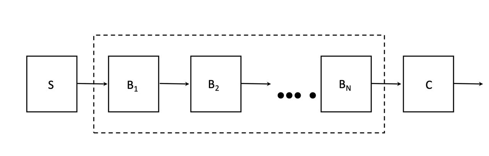

# ExBranchNet

# 🎯 CIFAR-10 Classification Project

Welcome to the CIFAR-10 Classification repository! This project implements a convolutional neural network (CNN) model for classifying CIFAR-10 images. The model is built strictly according to the coursework guidelines and is composed of three main parts:

- **Stem:** Extracts initial low-level features from input images.
- **Backbone:** A sequence of blocks, each containing an expert branch and multiple convolution branches whose outputs are combined.
- **Classifier:** Maps the final feature representation to one of the 10 classes.

---

## 🌟 Project Overview

The primary objectives of this project are to:

- **Download and preprocess the CIFAR-10 dataset** with data augmentation and normalization.
- **Implement the specified model architecture** with a Stem, Backbone (with expert branches and multiple convolution branches), and Classifier.
- **Create a complete training pipeline** with loss, optimizer, and learning rate scheduling.
- **Visualize training progress** via loss and accuracy curves.
- **Save the trained model** for further evaluation.

---

## 💻 Tech Stack


---

## 🏗️ Model Architecture

The model follows the coursework guidelines and is divided into three main components:

### 🔥 Stem
The Stem processes raw input images through a convolution layer, Batch Normalization, and a ReLU activation function to extract low-level features.


---

### 🔥 Backbone
The Backbone comprises several blocks (B1, B2, …, BN). Each block includes:

- **Expert Branch:**  
  - Applies global average pooling to the feature maps.
  - Processes the pooled features through two fully connected (FC) layers with a reduction in dimensionality.
  - Uses a Softmax layer to generate a weight vector for combining the outputs of the convolution branches.

- **Convolution Branches:**  
  - Multiple convolution layers process the input features.
  - Their outputs are combined using the weights from the expert branch.


---

### 🔥 Block & Expert Branch Details

Each block in the backbone contains the expert branch and the convolution branches.


---

### 🔥 Classifier
The Classifier normalizes the refined feature maps using BatchNorm, applies global average pooling, and then maps the flattened features to 10 class logits using a fully connected layer.


---

### 🔥 Complete Model
The full model is an assembly of the Stem, Backbone, and Classifier.



---

## ⚙️ Setup Instructions

Follow these steps to set up and run the project on your local system:

1. **Clone the Repository**

   ```bash
   git clone https://github.com/yourusername/cifar10-classification.git
   cd cifar10-classification
   ```

2. **Create a Virtual Environment**

   ```bash
   python -m venv venv
   ```

3. **Activate the Virtual Environment**

   - **On Windows:**
     ```bash
     venv\Scripts\activate
     ```
   - **On macOS/Linux:**
     ```bash
     source venv/bin/activate
     ```

4. **Install Dependencies**

   ```bash
   pip install -r requirements.txt
   ```
   *Note:* If you don’t have a `requirements.txt`, install the following packages:
   ```bash
   pip install torch torchvision matplotlib tqdm
   ```

5. **Run the Training Script**

   ```bash
   python train.py
   ```
   This command will:
   - Download the CIFAR-10 dataset.
   - Train the model for 20 epochs.
   - Plot training loss and accuracy curves.
   - Save the trained model weights as `cifar10_model.pth`.

---

## 📈 Training Details

- **Dataset:** CIFAR-10 (10 classes)
- **Model Architecture:** Stem + Backbone (Blocks with Expert Branch) + Classifier
- **Loss Function:** CrossEntropyLoss
- **Optimizer:** SGD with Momentum and Weight Decay
- **Epochs:** 20 (for faster execution; adjust as needed)
- **Batch Size:** 128
- **Learning Rate Scheduler:** MultiStepLR (milestones at epochs 10 and 15)

---

## 📜 License

This project is licensed under the MIT License. See the [LICENSE](LICENSE) file for more details.

---

## 📧 Contact

For any questions or feedback, feel free to reach out at [arjunsridhar445@gmail.com](mailto:your-email@example.com).

---

## ☕ Support Me

If you enjoy this project, consider buying me a coffee!

[](https://buymeacoffee.com/smoothglitch)
